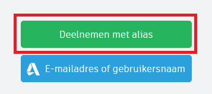

# TinkerCAD

## Instructies om in te loggen bij TinkerCAD

* Ga naar de TinkerCAD website: [https://www.tinkercad.com](https://www.tinkercad.com)
* Als de website niet in het Nederlands is, scroll dan naar beneden en selecteer (onder het kopje AUTODESK) Nederlands als taal: 

* Scroll naar beneden (als je dat niet gedaan hebt in de vorige stap) en klik op **Deelnemen aan de les**: 

* Vul de code in en klik op **Ga naar mijn les**: 

* Kies **Deelnemen met alias**: 

* Vul je Alias in en klik op **Dat ben ik!**: 

## TinkerCAD opdrachten

Ga naar de website van CoderDojo KopGroep: [https://www.coderdojo-kopgroep.nl/opdrachten/#LeerpadTinkerCAD](https://www.coderdojo-kopgroep.nl/opdrachten/#LeerpadTinkerCAD)

